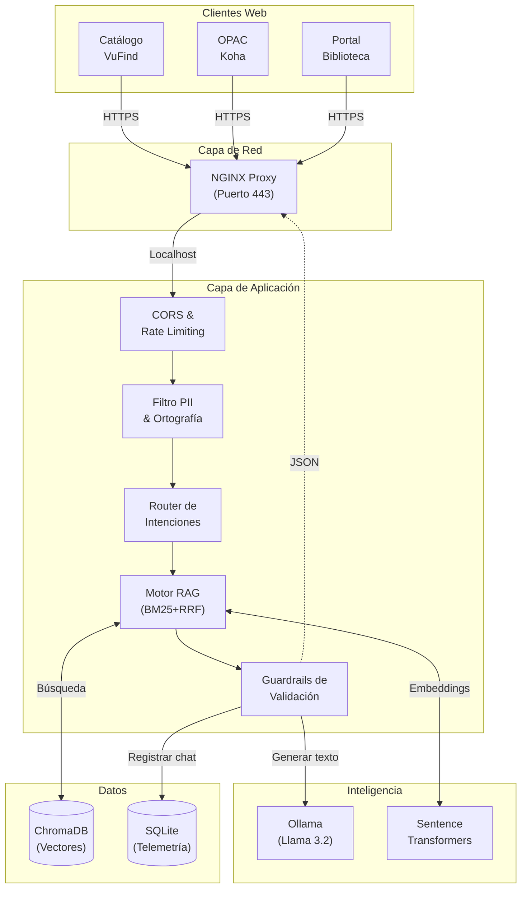

# Diagrama y Flujo de Datos End-to-End

Este documento describe la arquitectura fisica y logica del sistema AmiBot, detallando como viaja la informacion desde que el estudiante interactua con la interfaz web hasta que el modelo de Inteligencia Artificial procesa la respuesta.

## Glosario Simplificado

Para facilitar la comprension del flujo a audiencias no tecnicas, aqui se explican los terminos clave:

* **DOM (Document Object Model):** Es la estructura invisible que compone una pagina web, cuando decimos que el chat esta "incrustado en el DOM", significa que el chat se dibuja y forma parte directa de la pagina web oficial que el estudiante ya esta viendo.
* **Sanitizacion:** Es el proceso de "limpiar" el texto que el usuario escribe, eliminando caracteres extranos o peligrosos antes de que el sistema los lea.
* **Inyeccion XSS:** Un tipo de ciberataque donde un usuario malicioso intenta escribir codigo trampa en el chat para hackear la pagina. La sanitizacion bloquea esto.
* **POST asincrono:** Es la accion de enviar un mensaje al servidor "en segundo plano". Permite que el chat funcione de forma fluida sin que toda la pagina web de la biblioteca tenga que recargarse cada vez que envias un mensaje.
* **Nginx (Proxy Inverso):** Funciona como un "guardia de seguridad" o recepcionista en la puerta del servidor de la universidad. Recibe todas las conexiones de internet, verifica que sean seguras (candado SSL) y las enruta al destino interno correcto.
* **Demon (Daemon):** Un programa de computadora que funciona de forma silenciosa en segundo plano, esperando recibir instrucciones (por ejemplo, Ollama esperando que le pasen preguntas para pensar una respuesta).
* **Uvicorn / FastAPI:** Es el "motor" y "cerebro" principal donde vive nuestro codigo. Uvicorn lo hace funcionar a gran velocidad, y FastAPI es la estructura con la que programamos las reglas.
* **Middleware CORS:** Un inspector en la frontera del servidor. Su unico trabajo es revisar desde que pagina web se envia el mensaje (ej. catalogo.example.edu) y bloquearlo si viene de un sitio no autorizado.
* **SlowAPI (Rate Limiting):** Un freno de emergencia. Evita que un mismo usuario envie 100 mensajes por segundo intentando saturar o botar el servidor (ataque DDoS).
* **Enmascaramiento PII (Regex):** "PII" significa Informacion de Identificacion Personal. Es un filtro que detecta RUTs, telefonos o correos en el chat y los censura (ej. 19.xxx.xxx-x) para proteger la privacidad del estudiante.
* **Bypass (Cortocircuito):** Es un atajo inteligente. Si el sistema ya tiene la respuesta exacta y perfecta guardada, la devuelve al instante saltandose a la Inteligencia Artificial. Esto ahorra tiempo y procesador (CPU).
* **Guardrails:** Funcionan como las "barandas de contencion" de una carretera. Son reglas que evitan que el bot se salga del tema (ej. recetas de cocina) o responda incoherencias.
* **SQLite (Modo WAL):** Es la bitacora historica. Ahi guardamos el registro y estadisticas de los chats. El modo WAL es un truco tecnico que permite que decenas de estudiantes chateen a la vez sin que la base de datos se bloquee.

## Diagrama de Arquitectura

El sistema opera bajo un modelo de microservicios centralizados en un unico servidor fisico. A continuacion se ilustra la topologia de red y los flujos de conexion:

## Flujo de Procesamiento End-to-End

El ciclo de vida de una consulta (request) procesada por AmiBot consta de 6 etapas secuenciales:

### 1. Inyeccion y Captura (Frontend)
El script de JavaScript (`chat-biblio-test.js`) se encuentra incrustado en el DOM de las paginas de la biblioteca. Cuando el usuario presiona "Enviar", el JS aplica un primer filtro de sanitizacion para evitar inyecciones XSS basicas. Luego, se genera un HTTP POST asincrono apuntando al proxy Nginx de la universidad.

### 2. Capa de Red y Proxy (Nginx)
Nginx intercepta el trafico seguro (HTTPS en el puerto 443), verifica los certificados SSL y, si la ruta incluye el prefijo `/chat-api`, redirige el trafico limpio internamente hacia el servidor de Uvicorn/FastAPI expuesto en `127.0.0.1:8000`.

### 3. Seguridad y Preprocesamiento (FastAPI)
FastAPI recibe la peticion. Primero, el middleware **CORS** evalua si el origen esta en la lista permitida. Luego, el modulo **SlowAPI** confirma que el usuario no este atacando el servidor (Rate Limiting). Si todo es correcto, la cadena de texto pasa por el modulo de **Enmascaramiento PII** (Regex), que anonimiza RUTs y correos. Posteriormente se corrigen faltas de ortografia criticas en memoria.

### 4. Clasificacion de Intenciones y RAG Hibrido
El sistema evalua si la pregunta pertenece a un grupo de "intenciones criticas" (credenciales, contrasenas, bases de datos). De ser asi, se asignan pesos de refuerzo (+0.25). A continuacion, se buscan fragmentos de conocimiento relevantes en la base estatica. Esto se logra buscando paralelamente similitud semantica (ChromaDB mediante *SentenceTransformers*) y similitud de palabras clave (BM25). Ambos rankings se unen y promedian matematicamente mediante RRF (Reciprocal Rank Fusion).

### 5. Invocacion del Modelo de Lenguaje (Si es necesario)
El motor de **Guardrails** lee los resultados obtenidos. Si el resultado es lo suficientemente explicito y coincide de manera rigida con el conocimiento estatico, se ejecuta un "bypass" (cortocircuito) devolviendo esa respuesta al instante, ahorrando CPU.
Solo si la pregunta es ambigua o requiere conversacion elaborada, FastAPI utiliza un hilo paralelo (`asyncio.to_thread`) para comunicarse con el demon local de **Ollama** en el puerto 11434, enviandole el contexto extraido para que redacte una respuesta contextual natural.

### 6. Persistencia y Respuesta (Backend -> Frontend)
Antes de enviar la respuesta al usuario, el hilo principal de la aplicacion interactua con **SQLite** para registrar (en modo *Write-Ahead Logging*) la interaccion completa: el ID de sesion, la pregunta (ya enmascarada), el origen, la respuesta generada y el tiempo de computo. Finalmente, la respuesta se envia al cliente en formato JSON, donde el navegador del usuario la sanitiza por segunda vez, linkifica las URLs detectadas, y la imprime en pantalla simulando tipeo humano.
