# Stack Tecnologico y Seguridad

AmiBot esta disenado no solo para responder preguntas de manera inteligente, sino para hacerlo dentro de un entorno universitario seguro, aislado y respetuoso de la privacidad de los estudiantes.

## 1. Stack Tecnologico

El sistema utiliza las siguientes tecnologias de codigo abierto, elegidas especificamente por su capacidad de funcionar offline y sin costos de licenciamiento (Zero-Cost).

| Componente | Tecnología | Responsabilidad Principal |
| :------------------- | :------------------------- | :--------------------------------------------------------------------------- |
| **Frontend UI** | JavaScript (Vanilla) + CSS | Widget web incrustado; captura de texto; prevención de XSS. |
| **Web Server** | Uvicorn + Nginx | Manejo de peticiones asíncronas y certificados SSL (HTTPS). |
| **Backend API** | FastAPI (Python 3.9) | Enrutamiento, validación de CORS, limitación de peticiones y lógica core. |
| **Vector Database** | ChromaDB | Almacenamiento persistente de vectores (Embeddings) para búsqueda semántica. |
| **Telemetría** | SQLite 3 (Modo WAL) | Registro de logs de chat, métricas de latencia y feedback de usuarios. |
| **RAG Léxico** | Rank-BM25 | Búsqueda por frecuencia probabilística de palabras clave. |
| **RAG Semántico** | SentenceTransformers | Conversión de texto a matrices matemáticas (Embeddings locales). |
| **Generación (LLM)** | Ollama (Llama 3.2 1B) | Redacción de respuestas complejas en lenguaje natural. |

## 2. Mecanismos de Seguridad y Privacidad

El diseno del chatbot incluye multiples "barreras" para evitar ataques de denegacion de servicio (DDoS), consultas desde paginas externas no autorizadas y fuga de datos personales (PII).

1. **CORS (Cross-Origin Resource Sharing):** La API solo acepta peticiones que provengan estrictamente de `catalogo.example.edu` y `biblioteca.example.edu`. Si alguien intenta clonar el chat en su propio sitio web, el servidor rechaza la conexion.
2. **SlowAPI (Rate Limiting):** El servidor rechaza automaticamente a cualquier direccion IP que intente enviar mensajes demasiado rapido. Esto previene que robots saturen a Ollama.
3. **Enmascaramiento PII (Regex):** Antes de que el mensaje del estudiante sea procesado por la base de datos o leido por el modelo de IA, el texto se inspecciona buscando patrones de RUT chilenos, numeros de telefono o correos electronicos. Si los encuentra, los censura (ejemplo: reemplaza el RUT por `[RUT_OCULTO]`). Esto garantiza el anonimato total en los registros de SQLite.

## 3. Diagrama de Secuencia: Flujo de Seguridad

El siguiente diagrama visualiza como actuan las barreras defensivas milisegundos despues de que el estudiante presiona "Enviar", asegurando que la Inteligencia Artificial nunca lea informacion comprometida.

```mermaid
sequenceDiagram
    participant Usuario as Estudiante
    participant Frontend as Widget Web<br>(Koha)
    participant Nginx as Proxy<br>Nginx
    participant API as FastAPI<br>Backend
    participant Motor as RAG /<br>Ollama

    Usuario->>Frontend: Escribe: "Mi rut es 19.xxx.xxx-x"
    Frontend->>Frontend: Sanitiza scripts (XSS)
    Frontend->>Nginx: POST /chat-api/
    Nginx->>API: Redirige (Puerto 8000)
    
    rect rgb(50, 50, 50)
        Note over API: Capa de Seguridad (Backend)
        API->>API: Valida Origen (CORS)
        API->>API: Valida Rate Limit
        API->>API: Aplica Filtro PII
    end
    
    API->>Motor: Envía texto limpio (Anonimizado)
    Motor-->>API: Genera respuesta
    API-->>Nginx: Devuelve JSON HTTP 200
    Nginx-->>Frontend: Retorna datos
    Frontend-->>Usuario: Imprime en pantalla
```

### Explicación del Flujo
1. **Frontend:** Cuando el estudiante envía un mensaje, el widget de chat aplica una primera limpieza rápida para bloquear intentos básicos de hackeo (XSS).
2. **Nginx:** El tráfico encriptado llega a la universidad y Nginx lo enruta internamente hacia la API de AmiBot.
3. **Capa de Seguridad (Backend):** Antes de gastar CPU buscando una respuesta, el sistema verifica dos cosas: que la petición venga de un portal oficial (CORS) y que no se trate de un ataque masivo de mensajes (SlowAPI). Luego, el filtro PII analiza la frase. Si detecta un RUT o correo, lo censura y lo reemplaza por la etiqueta `[RUT_OCULTO]`.
4. **Motor Limpio:** La Inteligencia Artificial recibe y procesa el texto de manera totalmente anónima. La IA responde y el texto viaja de regreso al navegador del usuario.
